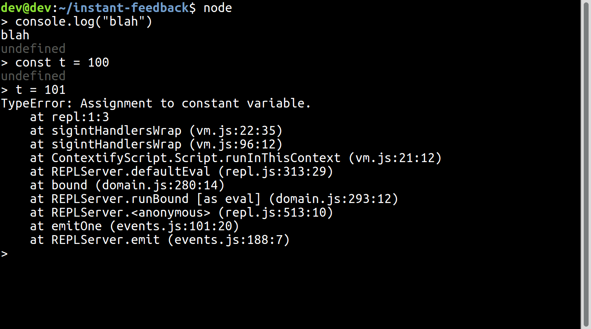
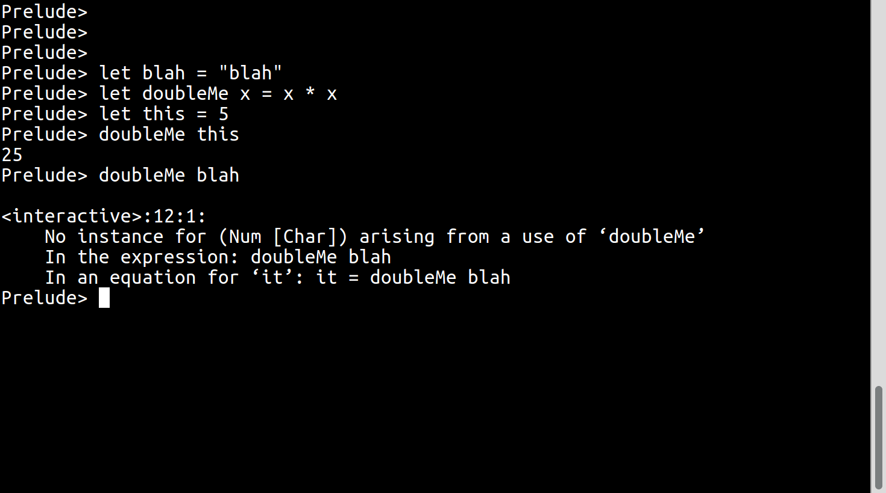

#inotifywait
Use ```inotifywait```to run a script when you save it.

```bash
inotifywait -qe modify blah.sh
./blah.sh
```

See [waitandrun](bin/waitandrun) for a wrapper.


Running Haskell as a script
```haskell
#!/usr/bin/runhaskell
```

# Interactive sessions
Interactive sessions can be fun but copying your changes back into the source
file can feel a little clunky.

*Node.js shell*


*Haskell's GHCI interactive shell*


# tmux
Alternative to ```screen``` but also offers vertical splits.

# Video processing
See how [these videos](video.md) were made.
