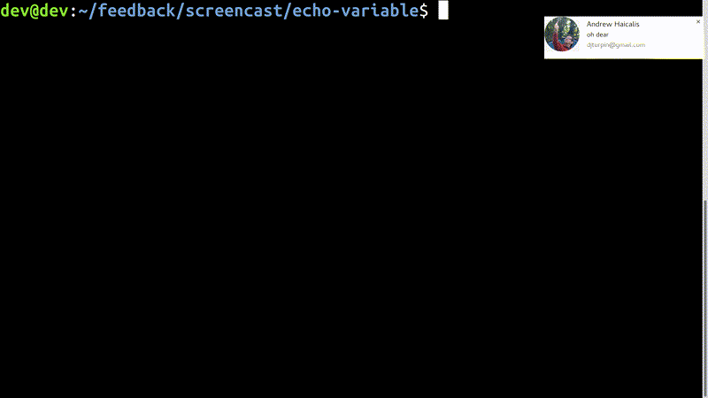

# Setup
- Open terminal
- Full screen (F11)
- Hide menu
- Zoom in five times (ctrl-+)

# Capture keys
Run the script with a project name
```bash
bin/capture echo-variable
```

This creates a directory and stores the keystrokes to it
```bash
$ ll
total 16
drwxrwxr-x 2 dev dev 4096 Jan  6 15:16 ./
drwxrwxr-x 5 dev dev 4096 Jan  6 15:16 ../
-rw-rw-r-- 1 dev dev  863 Jan  6 15:17 cast
-rw-rw-r-- 1 dev dev 3001 Jan  6 15:17 cast.timing
```

# Generate animated GIF
Supply the project name by running the render script. This replays the
keystrokes and renders an animated GIF in the project directory.
```bash
bin/render echo-variable
```
# What's my window size?
Make the terminal full screen (F11) and hide the menu.

```bash
$ xwininfo 

xwininfo: Please select the window about which you
          would like information by clicking the
          mouse in that window.

xwininfo: Window id: 0x1a0a261 "~/feedback"

  Absolute upper-left X:  0
  Absolute upper-left Y:  0
  Relative upper-left X:  0
  Relative upper-left Y:  0
  Width: 3200
  Height: 1800
  Depth: 32
  Visual: 0x4c
  Visual Class: TrueColor
  Border width: 0
  Class: InputOutput
  Colormap: 0x1a00005 (not installed)
  Bit Gravity State: NorthWestGravity
  Window Gravity State: NorthWestGravity
  Backing Store State: NotUseful
  Save Under State: no
  Map State: IsViewable
  Override Redirect State: no
  Corners:  +0+0  -0+0  -0-0  +0-0
  -geometry 176x52+0+0
```
